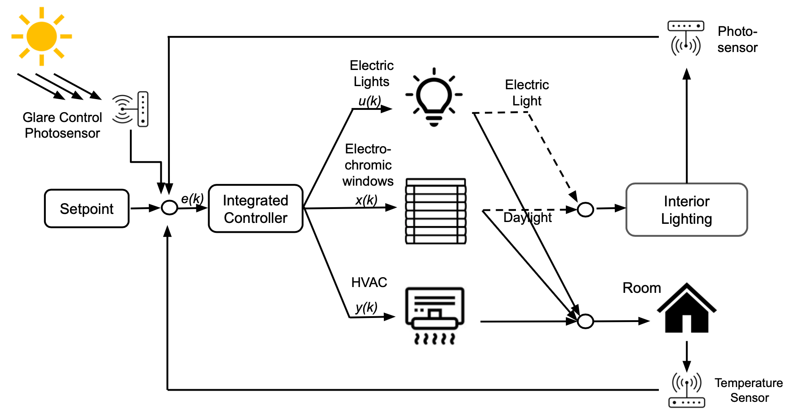

# Advanced Facade Controller (AFC)

[](https://github.com/LBNL-ETA/AFC/actions/workflows/syntax-test.yml)
[](https://github.com/LBNL-ETA/AFC/actions/workflows/unit-test.yml)

#### Predictive Control Solution for Advanced Facades and Integrated Energy Systems
----------------------------------------------------------------------------------------


## General
This publicly available control package was developed to allow easy access to integrated dynamic facade and smart building control algorithms developed by Lawrence Berkeley National Laboratory's (LBNL) [Windows Group](https://windows.lbl.gov/). Dynamic facades can be any automated facade product such as motorized blinds, shades, or electrochromic windows. The control algorithms are based on the [Model Predictive Control](https://en.wikipedia.org/wiki/Model_predictive_control) technique and utilize LBNL’s Distributed Optimal Energy Resources ([DOPER](https://github.com/LBNL-ETA/DOPER)) and Framework for Multi-Layer Control ([FMLC](https://github.com/LBNL-ETA/FMLC)) developments to implement the algorithms.


A general overview of integrated dynamic facade and smart building controls can be found in the [Smart Buildings Breakthrough Technology](https://windows.lbl.gov/news/smart-buildings-breakthrough) news article.

The Advanced Facade Controller (AFC) is designed to minimize electricity cost and/or emissions in buildings through the control of dynamic facades (for example electrochromic windows, blinds, and shades), and lighting and HVAC systems. The AFC also considers a variety of control parameters such as visual and thermal comfort (glare, daylight, view, health, and wellness). It uses weather forecasts, and a set of measurements (room and floor temperature) to optimize control setpoints over a specified time horizon of typically 24 hours. The functionality illustrated below:



*Please note that the AFC package and especially the examples are still under development. Please open an issue for specific questions.*

## Getting Started
The following link permits users to clone the source directory containing the [AFC](https://github.com/LBNL-ETA/AFC) package and then locally install with the `pip install` command.

Alternatively, AFC can be directly installed with `pip install git+https://github.com/LBNL-ETA/AFC`.

## Use
Standard usage of the AFC package follows the sequence of steps outlined in the example here.

### 1 System configuration
The AFC package requires sets of parameters and inputs that describe the optimization problem. On the one hand, the parameters are quantities that describe the physical system on which the optimization is performed. Parameters include, for example, the location and size of the building, its number of windows or the number of occupants in the room. On the other hand, data inputs describe the climatic context of the optimization. These are essentially exogeneous meteorological forecasts of the sun's irradiance on the building. Unlike parameters, data inputs are time-dependent variables. 

#### 1.1 Define system parameters
The `parameter` object is a dictionary containing parameter values describing the system to be controlled by AFC. The built-in function `defaultConfing` contains default parameters which can be helpful to get started. Users can modify the parameters to create a setup that meets their specific building. An alternative way to establish the parameters is through a JSON text file. For more information see [here](docs/json_configuration.md).

```python
# initialize afc with default parameters 
from afc.defaultConfig import default_parameter
parameter = default_parameter()
```

Please refer to the detailed documentation for each of the parameters in [Defining System Parameter Inputs](docs/parameter.md) for a full list on all model options and settings that can be defined within the `parameter` object. The following presents only a high-level summary.

The parameters can be divided into two categories: 
Those in common with the DOPER package (please see the [DOPER documentation](https://github.com/LBNL-ETA/DOPER) for more details) include the following entries:
- `controller`: General settings of the controller such as optimization horizon, timestep, and location of solvers.
- `fuels`: Energy providing fuels within the model to power generators and other assets. This is typically not used in AFC.
- `objective`: Definition of the controller’s objective such as weights that are applied when constructing the optimization’s objective function.
- `site`: Site specific general characteristics, interconnection constraints, and regulation requirements.
- `solver_options`: Settings specific to the solver such as maximal solver time.
- `system`: System specific settings such as enabling or disabling other distributed energy resources or load assets.
- `tariff`: Tariff related energy and power rates. Note that tariff time periods are provided in the separate time-series input below.

The parameters that are specific to AFC include the following entries:
- `facade`: Data used to describe the building and facade system on which the controller is implemented.
- `occupant`: Configuration of occupant comfort and internal load demand settings.
- `radiance`: Configuration of the facade system.
- `wrapper`: Configuration to manage the execution of AFC.
- `zone`: Configuration of each control zone within the building.

#### 1.2 Define Data (Time-series) Inputs
The optimization also needs additional data (time series) inputs to indicate the values for time-variable model inputs (such as weather data, occupancy, internal loads, etc.). Depending on the specific application of AFC, these are typically either provided by forecast models or building operators. The AFC package provides example data to represent weather forecasts for San Francisco, CA, as well as a function to read it.

```python
from afc.utility.weather import read_tmy3
from afc.utility.weather import example_weather_forecast
# read the weather file
wf = example_weather_forecast(date='2023-07-01')
```

The time-series input must be in the form of a pandas dataframe, indexed by timestamp, and contain the following weather forecast columns for the given location:
- `dhi`: Diffuse horizontal radiation, in W/m2.
- `dni`: Direct normal radiation, in W/m2.
- `temp_air`: Dry bulb temperature, in °C.
- `wind_speed`: Wind speed, in m/s.

To create the final input object which combines the parameter and data inputs, a built-in utility function `make_inputs` is available. It first adds additional computed time-series data inputs (see below) and then creates a nested dictionary with the combined inputs. The extended data inputs contain the following items:
- `equipment`: Zone internal equipment load, in W (populated from `parameter['occupant']['equipment']`).
- `generation_pv`: Amount of electricity generated by co-located photovoltaic generation, in W. This is typically set to 0 by default.
- `glare_max`: Maximum value for allowable glare.
- `load_demand`: Not used in AFC and set to 0.
- `occupancy_light`: Indication if zone is unoccupied (0) or occupied (1) (populated from `parameter['occupant'][‘occupancy_light’]`).
- `occupant_load`: Zone internal occupant thermal load, in W (populated from `parameter['occupant'][‘occupant_load’]`).
- `plug_load`: Zone internal electric plug load, in W (populated from `parameter['occupant'][‘plug_load’]`).
- `temp_room_max`: Maximum temperature of the room, in °C (populated from `parameter['occupant'][‘temp_room_max’]`).
- `temp_room_min`: Minimum temperature of the room, in °C (populated from `parameter['occupant'][‘temp_room_min’]`). 
- `temp_slab_max`: Maximum temperature of the floor, in °C. Default value is 1000.
- `temp_slab_min`: Minimum temperature of the floor, in °C. Default value is 0.
- `temp_wall_max`: Maximum temperature of the wall, in °C. Default value is 1000.
- `temp_wall_min`: Minimum temperature of the wall, in °C. Default value is 0.
- `wpi_min`: Minimum work plane illuminance, in lux (populated from `parameter['occupant'][‘wpi_min’]`).

In this example, relying on the code of the two previous sections, we would write the following code to generate the combined input object:

```python
# make input object from parameters and data inputsn
from afc.ctrlWrapper import make_inputs
inputs = make_inputs(parameter, wf)
```

### 2. Run Optimization to Determine Setpoints
After setting up the inputs, we can now create an instance of the AFC controller. To run the controller and conduct the optimization, the previously created `inputs` are passed to the `do_step method` of the controller instance. The result is a log string with status messages.

```python
from afc import Controller    
# initialize controller
ctrl = Controller()
# query controller
log = ctrl.do_step(inputs=inputs)
```

### 3. Output of Setpoints
The AFC controller provides a variety of outputs ranging from the desired control setpoints to more technical information on the optimization process. All outputs can be accessed using the `get_output` method as shown by the example below:

```python
# get all outputs
ctrl.get_output()
# get only facade setpoints
ctrl.get_output(keys=['ctrl-facade'])
```

These full list of outputs is here:
- `output-data`: Dataframe containing detailed time series data from the optimization (detailed below). Typically only used for debugging or visualizations.
- `ctrl-facade`: Control setpoint for dynamic facade, as list of setpoints for each zone.
- `ctrl-thermostat`: 
    - `feasible`: Boolean set to ‘True’ if the controller has been able to find optimal setpoints. 
    - `mode`: Operational mode of the HVAC system. Possible values are ‘X’ for no control, ‘F’ for floating, ‘C’ for cooling, and ‘H’ for heating
    - `csp`: Control setpoint for cooling thermostat, in °C.
    - `hsp`: Control setpoint for heating thermostat, in °C.
- `ctrl-troom`: Control setpoint for HVAC thermostat, in °C.
- `duration`: 
    - `all`: Total duration of the whole controller iteration, in sec.
    - `glare`: Duration to calculate window glare modes, in sec.
    - `optall`: Total duration of the optimization process, in sec.
    - `outputs`: Duration to solve the optimization problem, in sec.
    - `radiance`: Duration to calculate the radiance inputs, in sec.
    - `varts`: duration to resample for variable-timestep inputs, in sec.
- `opt-stats`:
    - `duration`: Duration of the optimization, in sec.
    - `objective`: Optimal value of the objective function.
    - `termination`: Status of optimization indicating whether the solver has reached an optimal solution, as string.


The `output-data` is a special entry as it contains time series data for all the inputs and outputs of the optimization process. It is not necessary for a general user to understand these, but might be important for developers or for debugging. The `output-data` can be formatted into a pandas dataframe and subsequently easily plotted and analyzed:

```python
# convert df_outputs to pandas
df = pd.read_json(io.StringIO(ctrl.get_output(keys=['output-data'])['output-data']))
df.index = pd.to_datetime(df.index, unit='ms')

# make exmaple plot of results
from afc.utility.plotting import plot_standard1
plot_standard1(df.iloc[:-1])

```

The detailed time series output data stored in `output-data` is provided as indexed dictionary:
- `artificial Illuminance`: Illuminance provided by artificial lighting, in lux.
- `export Power`: Electricity generated local generation which is fed back into the grid, in kW.
- `GHG Emissions`: Emissions associated with heating/cooling the room, in kg.
- `hour`: Hour of the day.
- `import Power`: Total amount of electricity consumed by the whole building site, in kW.
- `load Power`: Amount of electricity consumed by the building, in kW.
- `power Lights`: Amount of electricity consumed by artificial lighting, in kW​​.
- `PV Power`: Amount of electricity produced by local photovoltaic generation, in kW.
- `tariff_energy_export_map`: Tariff map to map time period to export power rates.I 
- `tariff_energy_map`: Tariff map to map time period to energy rates.
- `tariff Energy Period`: Tariff map to map time period to energy rates.
- `tariff_power_map`: Tariff map to map time period to peak power rates.
- `tariff Power Period`: Tariff map to map time period to peak power rates.
- `tariff_regdn`: Time dependent tariff for frequency regulation. Not used in AFC. 
- `tariff_regup`: Time dependent tariff for frequency regulation. Not used in AFC.
- `temperature`: Temperature inside the building, in °C.
- `window Illuminance`: Illuminance provided by natural daylight, in lux.

  
## Example
To test the installation and illustrate the functionality of AFC, the following command can be executed to run the [example_1.py](https://github.com/LBNL-ETA/AFC/blob/master/examples/example_1.py).

```python
python examples/example_1.py
```

The output should be:

```
Running AFC Example1...
Configuration: three zone electrochromic window

Log-message:
Duration [s]            0.21
Objective [$]           20.49           7.63 (Total Cost)
Cost [$]                13.39 (Energy)  7.02 (Demand)
CO2 Emissions [kg]      0.0

Facade actuation during the day (when DNI > 0).
Facade 0 = bottom zone, Facade 1 = middle zone, Facade 2 = top zone
State 0.0 = fully tinted, State 1.0 and 2.0 = intermediate tint, state 3.0 = clear (double low-e)

                     Facade State 0  Facade State 1  Facade State 2
2023-07-01 05:00:00             3.0             3.0             3.0
2023-07-01 06:00:00             3.0             3.0             3.0
2023-07-01 07:00:00             2.0             3.0             3.0
2023-07-01 08:00:00             3.0             2.0             3.0
2023-07-01 09:00:00             2.0             2.0             3.0
2023-07-01 10:00:00             2.0             2.0             3.0
2023-07-01 11:00:00             2.0             2.0             3.0
2023-07-01 12:00:00             2.0             2.0             3.0
2023-07-01 13:00:00             2.0             2.0             3.0
2023-07-01 14:00:00             2.0             2.0             3.0
2023-07-01 15:00:00             2.0             2.0             3.0
2023-07-01 16:00:00             3.0             2.0             3.0
2023-07-01 17:00:00             2.0             3.0             3.0
2023-07-01 18:00:00             3.0             3.0             3.0
2023-07-01 19:00:00             3.0             3.0             3.0
```

Additional examples with interactive Jupyter Notebooks can be found in the [examples](https://github.com/LBNL-ETA/AFC/blob/master/examples).

## Copyright Notice
Advanced Fenestration Control (AFC) Copyright (c) 2023, The Regents of the University of California, through Lawrence Berkeley National Laboratory (subject to receipt of any required approvals from the U.S. Dept. of Energy).  All rights reserved.

If you have questions about your rights to use or distribute this software, please contact Berkeley Lab's Intellectual Property Office at IPO@lbl.gov.

NOTICE.  This Software was developed under funding from the U.S. Department of Energy and the U.S. Government consequently retains certain rights.  As such, the U.S. Government has been granted for itself and others acting on its behalf a paid-up, nonexclusive, irrevocable, worldwide license in the Software to reproduce, distribute copies to the public, prepare derivative works, and perform publicly and display publicly, and to permit other to do so.

## Cite
To cite the AFC package, please use:

```bibtex
@article{gehbauer2020assessment,
title={An assessment of the load modifying potential of model predictive controlled dynamic facades within the California context},
author={Gehbauer, Christoph and Blum, David and Wang, Taoning and Lee, Eleanor S},
journal={Energy and Buildings},
volume={210},
pages={109762},
year={2020},
publisher={Elsevier}
}
```

## Further reading
For interested users additional information on the development process of AFC and its applications can be found in the following publications:

- Christoph Gehbauer, Eleanor S. Lee, Taoning Wang (2023), [An evaluation of the demand response potential of integrated dynamic window and HVAC systems](https://www.sciencedirect.com/science/article/pii/S0378778823007119?via%3Dihub), *Energy & Buildings 298*  (2023) 113481
- Christoph Gehbauer, David H. Blum, Taoning Wang, Eleanor S. Lee (2020), [An assessment of the load modifying potential of model predictive controlled dynamic facades within the California context](https://www.sciencedirect.com/science/article/pii/S0378778819317098?via%3Dihub), *Energy & Buildings 210* (2020) 109762
