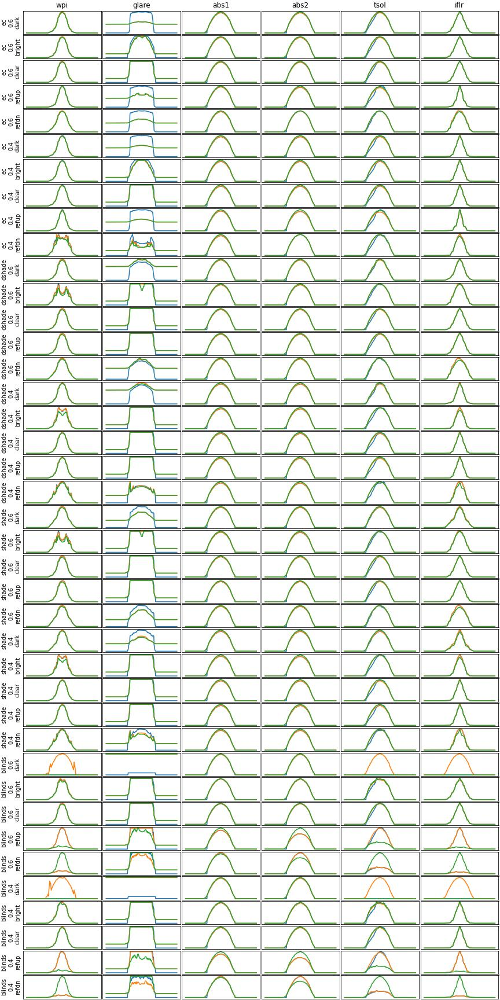

## Update to new frads version

This folder contains development tools for the update of AFC from Version 0.0.1 to 1.1.0.

The radiance and frads backend was updated to use latest frads within the AFC computation.

Results are verified by running the "Compare ALL Radiance.ipynb" Notebook before and after the update.

Note that the previous results are permanently stored in 20240124T192443-old-compare.json and new results are stored in 20240125T233411-new-compare.json.

## Findings

The result plots are given below. With emulator (old) in blue, controller (old) in orange, and controller (new) in green.

Observations:

- Results for cases electrochromic (ec), shade (shade), and dark shade (dshade) match.
- Results for blinds "dark" (90 deg) where blinds are fully shut deviate. This is due to an error in the old controller (orange). Emulator and new controller match (must be all zero dur to sun being fully blocked).
- Results for blinds "refup" (+30 deg) and "refdn" (-30 deg) deviate. This is due to a previously uncatched error where tilt angles were inverted. This is fixed with the new controller and tilt angles are correct now.

